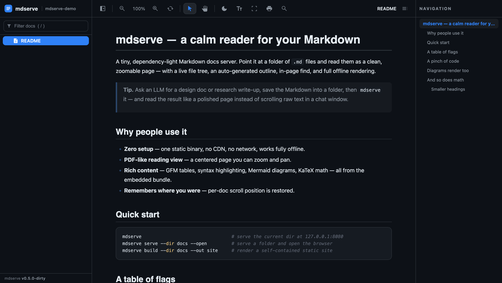
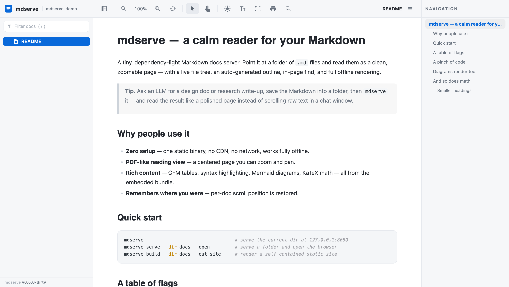
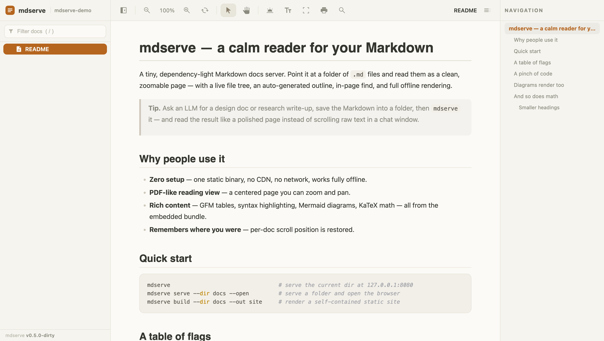

#  mdserve

A tiny, dependency-light Markdown docs server. Point it at a directory of `.md`
files and browse them as HTML with a live left-nav; or render them to a static
site.

## Great for

- **Reading what an LLM wrote.** Ask Claude/ChatGPT for a design doc, spec, or
  research write-up, save the Markdown into a folder, then `mdserve` it — read
  the result as a clean, zoomable page with a live outline and in-page find,
  instead of scrolling raw text in a chat window.
- **Browsing a repo's `docs/` offline** — tables, Mermaid diagrams, KaTeX math
  and syntax-highlighted code all render with no build step and no network.
- **Reviewing generated notes & reports** — plans, postmortems, meeting notes,
  anything you keep as `.md`, in a calm PDF-like reading view.
- **Publishing** a folder of Markdown as a self-contained, offline static site
  with `mdserve build`.

## Screenshots

Three built-in themes — one toolbar button cycles them:

| Dark (default) | Light | Warm |
|:--:|:--:|:--:|
|  |  |  |

## Features

A single-page Markdown reader: Markdown renders in the browser and the whole
front-end bundle is embedded, so it works **fully offline** — no CDN, no
network.

- **Reads the current directory** — a bare `mdserve` serves the folder you're
  standing in (free-port fallback if `127.0.0.1:8080` is taken, race-free via
  `net.Listen` on `:0`).
- **PDF-like reading view** — a centered page you can zoom (buttons, `Ctrl ±`,
  or `Ctrl`+wheel anchored at the cursor) and pan with the hand tool.
- **Three themes** — dark (default), light, warm; one button cycles them.
- **Folder tree + filter** — collapsible directories with Google Material
  Symbols file/folder icons; the `/` key jumps to the filter box.
- **Collapsible, resizable rails** — the file sidebar (`Cmd/Ctrl B`) and the
  outline (`` Cmd/Ctrl \ ``); widths and state persist in `localStorage`.
- **Auto outline** — a heading navigator with scroll-spy on the right.
- **In-page find** — `Cmd/Ctrl F`, highlight and step through matches.
- **Rich content** — GFM tables, syntax highlighting (highlight.js), Mermaid
  diagrams, and KaTeX math, all from the embedded bundle.
- **Remembers where you were** — per-doc scroll position is restored.
- **Live-reload** — the page polls for `.md` changes and re-renders in place.
- **Browser auto-open** (`--open`); a **colorized, columnar request log**
  (time · status · method · duration · path).
- **Static build** — `mdserve build` renders a self-contained, offline HTML
  tree (the vendor bundle is copied alongside).
- Path-traversal-safe; serves only `.md` under the configured root.

## Install

No toolchain needed — grab a prebuilt binary:

```sh
curl -fsSL https://raw.githubusercontent.com/mostafa-re/mdserve/main/scripts/install.sh | sh
```

Detects your OS/arch and installs to `~/.local/bin` (override with
`MDSERVE_VERSION` / `MDSERVE_BINDIR`).

### Releases

Every `vX.Y.Z` tag ships prebuilt archives — **macOS, Linux, Windows ×
amd64/arm64**, each with a SHA-256 sum — on the
[releases page](https://github.com/mostafa-re/mdserve/releases). Download the one
for your platform, unpack it, and put `mdserve` (or `mdserve.exe`) on your
`PATH`; on Windows use the `.zip`.

| OS | Arch | Asset |
|---|---|---|
| macOS | Apple Silicon | `mdserve_<tag>_darwin_arm64.tar.gz` |
| macOS | Intel | `mdserve_<tag>_darwin_amd64.tar.gz` |
| Linux | x86-64 | `mdserve_<tag>_linux_amd64.tar.gz` |
| Linux | ARM64 | `mdserve_<tag>_linux_arm64.tar.gz` |
| Windows | x86-64 | `mdserve_<tag>_windows_amd64.zip` |
| Windows | ARM64 | `mdserve_<tag>_windows_arm64.zip` |

### Update

```sh
mdserve update          # replace the running binary with the latest release
mdserve update --check  # only report whether a newer release exists
mdserve version         # release tag, or dev+<commit> for a source build
```

<details><summary>Build from source (needs Go)</summary>

```sh
go install github.com/mostafa-re/mdserve@latest
```

</details>

## Usage

```sh
mdserve                                         # serve the current dir at 127.0.0.1:8080
mdserve serve --dir docs --open                 # serve, free-port, open browser
mdserve serve --dir docs --addr :9000           # fixed port
mdserve build --dir docs --out site             # static HTML tree
mdserve serve --dir docs --default-doc plan/README.md   # custom landing doc
```

| flag | default | notes |
|---|---|---|
| `--dir` | `.` | directory of `.md` files (defaults to the current dir) |
| `--addr` | `127.0.0.1:8080` | loopback only; falls back to a free port if taken |
| `--default-doc` | `README.md` | doc opened at `/` |
| `--open` | off | open the browser |
| `--no-reload` | off | disable live-reload polling (serve) |
| `--no-cdn` | off | deprecated — assets are always embedded (no-op) |
| `--out` | — | output dir (build, required) |

## Design

One static Go binary. Markdown is rendered client-side by marked.js; the file
tree (`/api/tree`), file contents (`/raw`), and change polling (`/api/poll`)
are tiny JSON/text endpoints. The front-end vendor bundle — marked,
highlight.js, Mermaid, KaTeX (+ its fonts) — is embedded with `go:embed` and
served from `/vendor/`, so both the live reader and the static build work with
no network. Live-reload is an mtime poll, so there is zero extra dependency and
identical behavior across OSes. `gomarkdown` renders the static build only.

## Use in a project

A Makefile target that shells out to the installed binary:

```make
doc:        ## Serve docs/ as HTML (free port, opens browser)
	@mdserve serve --dir docs --default-doc README.md --open
doc-build:  ## Render docs/ to docs/_site/
	@mdserve build --dir docs --out docs/_site
```

> **Local docs only.** mdserve has no auth and renders raw repo Markdown; it
> binds for local browsing. Never run it as a public/deployed service.

## Development

```sh
make build              # build ./bin/mdserve (version stamped from git)
make install            # go install, version-stamped
make run                # build + serve the current dir, open the browser
make test               # run the suite
make                    # list all targets
```

## License

[MIT](LICENSE).
